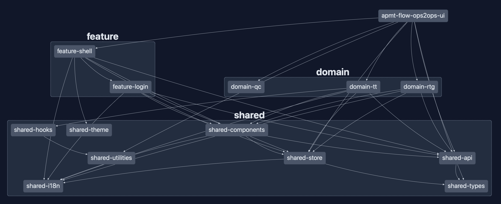

# apmt-flow-ops2ops-ui

✨ **This workspace has been generated by [Nx, a Smart, fast and extensible build system.](https://nx.dev)** ✨

- [Reqirements](#requirements)
- [Installation](#installation)
- [Configuring your IDE](#ide)
- [Scripts and Nx tasks](#scripts-and-nx-tasks)
- [Workspace structure](#workspace-structure)
- [Developing & Contributing](#developing-and-contributing)

## Requirements

You are as a minimum required to have a terminal of some sorts that will execute `Node version 18.19.0` and use the npm package manager that follows.

Should you have `nvm` installed you will be able to run the `nvm use` command for right Node version.

You must also be authenticated on our package repository via a personal access token as one option, but this is not the place for this - so contact a team member to help you if you need authentication setup.

Finally you will also have to have this repository cloned.

For SSH

```
git clone git@github.com:Maersk-Global/apmt-flow-ops2ops-ui.git
```

For HTTPS

```
git clone https://github.com/Maersk-Global/apmt-flow-ops2ops-ui.git
```

## Installation

Once the repository is installed you will have to run the npm installation for packages and post-installation scripts.

Step into the cloned repository folder (default name `apmt-flow-ops2ops-ui`) and execute the command:

```
npm install
```

Which should successfully install the required packages and execute the post-installation of git hooks for [commitlint](https://github.com/conventional-changelog/commitlint) and [lint-staged](https://github.com/lint-staged/lint-staged) via a [Husky](https://github.com/typicode/husky).

Simple as that (we hope).

## Configuring your IDE

The team highly recommends using VSCode, but aknowledges personal freedom when it comes to IDE.

Should you chose to go with VSCode there is some ease of setup help to be had to get going as of recommended extensions and workspace settings.

> VSCode can fetch the recommended extensions by going to Extensions and pick from the "Workspace" list.

> Make sure your IDE uses the workspace TypeScript version and not a custom/other version (zero-config for VSCode).

### The list of recommended extensions

- [Nx Console](https://marketplace.visualstudio.com/items?itemName=nrwl.angular-console)
- [ESLint](https://marketplace.visualstudio.com/items?itemName=dbaeumer.vscode-eslint)
- [Jest Runner](https://marketplace.visualstudio.com/items?itemName=firsttris.vscode-jest-runner)
- [Prettier - Code Formatter](https://marketplace.visualstudio.com/items?itemName=esbenp.prettier-vscode)
- [Stylelint](https://marketplace.visualstudio.com/items?itemName=stylelint.vscode-stylelint)
- [GitLens](https://marketplace.visualstudio.com/items?itemName=eamodio.gitlens)

**Note:** Nx Console is also Available for IntelliJ and comes with a LSP for Vim users [by clicking here](https://nx.dev/nx-console).

## Scripts and Nx tasks

The workspace utilises a variety of ways to enable execution of the required operations required to maintain and develop a modern web solution.

From the easiest, and most well known, scripts such as the default `npm start`, `npm test` & `npm build` to more specific project based Nx executors - or even more complex Nx generators.

To start and serve a development server with a dynamic port

```
npm start
```

To run unit tests for all projects

```
npm test
```

To create a production build of the application

```
npm build
```

NPM also provides a gateway into NX executors and generators from terminal (as NX is not to be installed globally).

To execute tasks with Nx use the following syntax:

```
npm run nx <target> <project> <...options>
```

You can also run multiple targets:

```
npm run nx run-many -t <target1> <target2>
```

..or add `-p` to filter specific projects

```
npm run nx run-many -t <target1> <target2> -p <proj1> <proj2>
```

**Note: It is generally a lot easier to use the Nx Console extension for VSCode**

**Note: Targets are defined in the `projects.json` - Learn more [in the docs](https://nx.dev/core-features/run-tasks)**

## Worskspace structure

The workspace is generated using the [Nx Workspace generator](https://nx.dev/getting-started/intro) and consist of 15 projects in 5 categories.

The categories are `apps`, `domain`, `feature`, `shared` & `tooling` - each with a folder of the same name in the root.

Each of those folders will contain any number of Nx generated and named projects - which may vary in setup and origin (what plugin was used to generate them).

- **apps**: Only 1 project, the client application and E2E test application.
  - apmt-flow-ops2ops-ui - _main application exposed to client._
- **domain**: Individual projects to be hosted by client application
  - domain-tt: _the application for all business logic related to TT needs._
  - domain-rtg: _the application for all business logic related to RTG needs._
  - domain-qc: _the application for all business logic related to QC needs._
- **feature**: Delivers and powers features to host main application and domains.
  - feature-shell: _the application shell component and logic_
  - feature-login: _handles login logic and execution to be used by shell_
- **shared**: Shared or common projects
  - api: _configurations, hooks etc.. to handle the API needs of the workspace_
  - components: _reusable workspace based react components_
  - hooks: _custom workspace based react hooks_
  - i18n: _the i18n proxy and configuration of the workspace_
  - store: _react context to serve as shared workspace store_
  - theme: _the mds theme proxy for workspace_
  - types: _shared types, especially those that could cause circular references_
  - utilities: _small utility pieces of code_
- **tooling**: Custom tooling scripts created with Nx generators to be compiled
  - fes-installer: _script that enables and installs Husky for git hooks_

Which gives the following example (moment in time) graph over the application - some projects omitted



Each project has any number of tasks configured by Nx for things such as unit tests, linting, typechecking, format checks - and some projects also the ability to build or publish.

The workspace is split into areas of concern as much as possible for the code to reflect and attempt the same, as well as strive to produce more smaller pieces of code, more smaller changes and many more but smaller deployments.

### How do I get access to that cool graph?

Nx provides a graphing tool to help overview the projects and the interdependencies

To spin up the Nx graph tool in a browser tab run:

```
npm run graph
```

## Developing & Contributing

As the pipeline will subject your code to linting and testing the extensions for ESLint etc.. will help warn you in time as will git hooks with commitlint and staged linting when you commit your code.

As a part of our commitlint convention adherance in order to have better automated documentation and github flow the branch naming also follows a convention as:

```
<type>/AFES-XXX
```

Where XXX is the AFES task ID and the allowed types are:

- feature
- chore
- fix
- docs
- refactor
- perf

e.g

> feature/AFES-1243

> chore/AFES-765

For your commits you will have to format accordingly to the [Conventional Commit Format](https://www.conventionalcommits.org/en/v1.0.0/) which dictates (simplified) that the commit message should be structured as follows:

```
<type>(optional scope): <description>
```

which, without scope, could be:

> docs: added a new comment to documentation

In order to apply scope we use the namespace from the project as identifier of scope:

> docs(shared-components): updated button documentation for new xxx property

You will be met with a prompt if your commit does not conform, and you can see the full list in the [commitlint.config.js](/commitlint.config.js) file.
